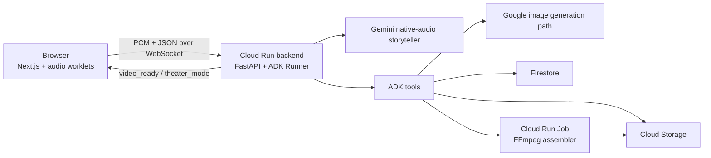

# Back to Somping, Back to Dody Land

Interactive voice-first storytelling for young children, built with Google ADK, Gemini native audio, FastAPI, Next.js, and Google Cloud.

Recommended Gemini Live Agent Challenge category: `Creative Storyteller`

## What This Project Actually Does

- A parent or guardian unlocks the app through a simple parent gate before microphone access.
- The child talks to Amelia through a live browser session.
- The frontend streams microphone audio over `/ws/story` and plays back live audio responses.
- The backend runs a Google ADK storyteller agent backed by a Gemini native-audio model.
- Scene storybeats are generated during the story with Gemini mixed `TEXT + IMAGE` output and pushed back to the browser as live events.
- The app can accept an optional uploaded toy/photo reference to help guide visuals.
- Ending the session triggers storybook assembly and theater mode, using deterministic cinematic camera moves from the trusted story images.
- The system also generates a personalized trading card for the child.

## Preschool Positioning

- The strongest use case is preschool and early-elementary storytelling, especially ages 4–5.
- Amelia helps children turn spoken imagination into illustrated picture stories before they can comfortably read, write, or draw everything they want to express.
- The product loop is: `Imagine -> Create -> Build -> Continue -> Finish`.

### Why This Matters

- Many young children have vivid ideas before they have the writing, drawing, or fine-motor skills to express those ideas independently.
- A voice-first picture-story flow removes that production barrier and keeps the child focused on imagination, sequencing, and spoken language.

### Educational Benefits

- Early literacy: beginning-middle-end structure, listening, vocabulary growth
- Cognitive development: sequencing, cause and effect, simple problem solving
- Communication: describing ideas, answering prompts, building confidence
- Creativity: imagination, visual storytelling, idea generation

## Important Accuracy Notes

- The current deployment config enables barge-in by default. The browser keeps the mic live, ducks narration on user speech, and the backend discards interrupted assistant turns instead of treating them as clean completions.
- The codebase contains Veo hooks, but the checked-in deployment defaults keep live/final Veo generation off. The default submission path is still-image storytelling plus assembled storybook video.
- The final storybook movie does not depend on a second generative video model. The assembler creates production-style camera motion from the approved scene stills to preserve character continuity.
- Live conversation audio comes from Gemini native audio. Storybook narration prefers ElevenLabs when configured and falls back to Google Cloud Text-to-Speech.
- Each scene beat asks Gemini for mixed `TEXT + IMAGE` output, producing a short storybook caption and matching illustration from one model response.
- ADK live session state is held in memory. Firestore is used for storybook/session persistence and final-output metadata during assembly.

## Stack

| Layer | Implementation |
| --- | --- |
| Live agent | Google ADK + Gemini native-audio model |
| Frontend | Next.js 15 + React 19 |
| Backend | FastAPI + Uvicorn |
| Scene storybeats | Google GenAI mixed `TEXT + IMAGE` generation path from `agent/tools.py` |
| Storybook assembly | Fast assembly path or FFmpeg Cloud Run Job |
| Storage | Cloud Storage |
| Persistence | Firestore |
| Secrets | Secret Manager |
| Optional integrations | ElevenLabs, Home Assistant MCP |

## Architecture



## Repository Layout

- `agent/`: Storyteller agent definition, prompts, and tools
- `backend/`: FastAPI server, WebSocket router, and FFmpeg worker
- `frontend/`: Next.js UI and browser-side audio/WebSocket logic
- `google_terraform/`: Google Cloud infrastructure as code
- `shared/`: Shared meta-learning helpers
- `deploy*.sh`: Build and deploy scripts

## Local Development

### Prerequisites

- Node.js 20+
- npm
- Python 3.11+
- `ffmpeg`

### 1. Configure environment

```bash
cp .env.example .env
```

At minimum for backend startup, fill in these required settings:

- `GOOGLE_API_KEY`
- `GOOGLE_CLOUD_PROJECT`
- `ELEVENLABS_API_KEY`

Notes:

- The current backend settings require `ELEVENLABS_API_KEY` at startup even though the core live voice path comes from Gemini native audio.
- `GOOGLE_CLOUD_LOCATION` defaults to `us-central1`.
- `GOOGLE_GENAI_USE_VERTEXAI` should stay `true` for the deployed backend if you want ADK live session resumption and Vertex-backed Gemini Live behavior.
- `STORYTELLER_LIVE_MODEL` defaults to `gemini-live-2.5-flash-native-audio` for Vertex-backed live storytelling.
- `GCS_ASSETS_BUCKET` and `GCS_FINAL_VIDEOS_BUCKET` have defaults in code, but you should set real bucket names for any cloud-backed flow.
- `FRONTEND_ORIGIN` should stay `http://localhost:3000` for local development unless you change the frontend port.

### 2. Start the backend

```bash
python3 -m venv .venv
source .venv/bin/activate
pip install -r backend/requirements.txt
uvicorn backend.main:app --host 0.0.0.0 --port 8000 --reload
```

Health check:

```bash
curl http://localhost:8000/health
```

Expected response:

```json
{"status":"ok","active_sessions":0}
```

### 3. Start the frontend

```bash
cd frontend
npm install
npm run dev
```

Notes:

- In local development, `frontend/next.config.js` proxies `/api/*` and `/ws/*` to `http://localhost:8000` by default.
- If you want to bypass the math gate locally, run the frontend with `NEXT_PUBLIC_REQUIRE_MATH=false`.

### 4. Open the app

Visit `http://localhost:3000`.

## Testing Room Lights Without Hardware

See [docs/testing_room_lights.md](docs/testing_room_lights.md) for the full test guide.

Quick start:

```bash
python3 scripts/mock_home_assistant.py --token test-token --allow-origin http://localhost:3000
```

Then set:

- Home Assistant URL: `http://127.0.0.1:8123`
- Long-Lived Access Token: `test-token`
- Light Entity ID: `light.story_room`

## Google Cloud Deployment

### Prerequisites

- `gcloud` authenticated to your project
- Docker
- Terraform 1.5+

### 1. Seed Secret Manager

Terraform creates the secret resources, but you must add secret values yourself:

```bash
echo -n "YOUR_GOOGLE_API_KEY" | gcloud secrets versions add storyteller-google-api-key --data-file=-
echo -n "YOUR_ELEVENLABS_API_KEY" | gcloud secrets versions add storyteller-elevenlabs-api-key --data-file=-
```

### 2. Configure Terraform

Edit `google_terraform/terraform.tfvars` with your project settings, domain, and image URIs if needed.

### 3. Apply infrastructure

```bash
cd google_terraform
terraform init
terraform apply -auto-approve
cd ..
```

### 4. Deploy the app

```bash
./deploy.sh all
```

You can also deploy individual components:

```bash
./deploy.sh backend
./deploy.sh frontend
./deploy.sh ffmpeg
./deploy.sh terraform
```

## Google Cloud Services Used

- Cloud Run for the backend and frontend
- Cloud Run Jobs for storybook movie assembly
- Cloud Storage for session assets and final videos
- Firestore for storybook/session persistence
- Secret Manager for API keys
- Google Cloud Text-to-Speech as a narration fallback
- Global HTTPS Load Balancer in Terraform

## Contest-Oriented Positioning

This project is now a defensible `Creative Storyteller` submission. The live ADK session remains voice-first, and each scene beat also uses Gemini mixed `TEXT + IMAGE` output to create an illustrated page caption plus matching artwork inside the same storytelling flow. It can still fit `Live Agents`, but the checked-in build now satisfies the Storyteller-specific mixed-output requirement.

## Submission Assets

- Root submission overview: `../README.md`
- Devpost copy: `../docs/submission/DEVPOST_SUBMISSION.md`
- Architecture diagram: `../docs/submission/ARCHITECTURE.md`
- Google Cloud proof: `../docs/submission/GOOGLE_CLOUD_PROOF.md`
- Criteria mapping: `../docs/submission/JUDGING_CRITERIA.md`
- Demo script: `../docs/submission/DEMO_VIDEO_SCRIPT.md`
- Checklist: `../docs/submission/SUBMISSION_CHECKLIST.md`
