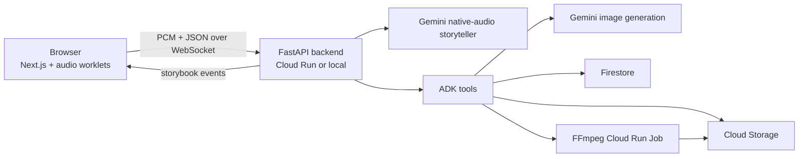

# StorySpark

StorySpark is a voice-first storytelling app for young children. A child talks to Amelia in the browser, the backend runs a Google ADK + Gemini live agent, scene illustrations are generated during the session, and the session ends as a storybook-style video with narration, music, and optional smart-home effects.

This repo contains the app code, Docker build definitions, and Google Cloud Terraform needed to reproduce the project.

## What It Does

- Streams microphone audio from the browser to a live backend over `/ws/story`
- Runs a Gemini native-audio storyteller agent with Google ADK
- Generates live story scene images during the conversation
- Persists story state and artifacts in Firestore and Cloud Storage
- Assembles a final storybook video locally or through a Cloud Run Job
- Supports optional ElevenLabs narration and Home Assistant room-light cues

## Stack

| Layer | Implementation |
| --- | --- |
| Frontend | Next.js 15 + React 19 |
| Backend | FastAPI + Uvicorn |
| Live agent | Google ADK + Gemini native-audio |
| Scene generation | Gemini mixed `TEXT + IMAGE` flow |
| Final assembly | In-process assembly or FFmpeg Cloud Run Job |
| Storage | Cloud Storage |
| Persistence | Firestore |
| Secrets | Secret Manager |
| Infra | Terraform + Cloud Run + HTTPS Load Balancer |

## Architecture



## Repository Layout

- `agent/` - storyteller agent definition, prompts, and tools
- `backend/` - FastAPI app, WebSocket router, and FFmpeg worker
- `frontend/` - Next.js app and browser audio/WebSocket logic
- `google_terraform/` - Google Cloud infrastructure as code
- `shared/` - shared storybook and meta-learning helpers
- `deploy*.sh` - image build and deploy helpers

## Reproducing The Project

There are three practical ways to run this repo:

1. Local app runtime: run FastAPI and Next.js directly on your machine
2. Local Docker runtime: run the same backend/frontend images used for Cloud Run
3. Full Google Cloud deployment: provision infra with Terraform and deploy with Docker + Cloud Run

> Local development is still cloud-backed. The backend uses Google Cloud Storage and Firestore directly, so you need Google application credentials locally even if the frontend and backend are running on your laptop.

## Prerequisites

- Node.js 20+
- npm
- Python 3.11+
- `ffmpeg`
- Docker
- `gcloud`
- Terraform 1.5+
- A Google Cloud project with billing enabled
- A real domain or subdomain if you want to apply the current load-balancer Terraform unchanged

## 1. Configure Environment

Copy the example env file:

```bash
cp .env.example .env
```

At minimum, set these values in `.env`:

- `GOOGLE_API_KEY`
- `GOOGLE_CLOUD_PROJECT`
- `ELEVENLABS_API_KEY`
- `GCS_ASSETS_BUCKET`
- `GCS_FINAL_VIDEOS_BUCKET`

Recommended local defaults:

- Keep `FRONTEND_ORIGIN=http://localhost:3000`
- Keep `GOOGLE_CLOUD_LOCATION=us-central1` unless you are changing regions everywhere
- Keep `LOCAL_STORYBOOK_MODE=1` for local-only runs so the backend assembles storybooks in-process instead of expecting the Cloud Run Job

You also need Google application credentials for local and Docker runs. Use one of these:

```bash
gcloud auth application-default login
```

or

```bash
export GOOGLE_APPLICATION_CREDENTIALS=/absolute/path/to/service-account.json
```

## 2. Run Locally Without Docker

Start the backend in one terminal:

```bash
python3 -m venv .venv
source .venv/bin/activate
pip install -r backend/requirements.txt
uvicorn backend.main:app --host 0.0.0.0 --port 8000 --reload
```

Health check:

```bash
curl http://localhost:8000/health
```

Expected response:

```json
{"status":"ok","active_sessions":0}
```

Start the frontend in a second terminal:

```bash
npm --prefix frontend install
npm --prefix frontend run dev
```

Then open `http://localhost:3000`.

Notes:

- In local development, [`frontend/next.config.js`](frontend/next.config.js) proxies `/api/*` and `/ws/*` to `http://localhost:8000`
- To disable the parent math gate locally, run the frontend with `NEXT_PUBLIC_REQUIRE_MATH=false`

## 3. Run Locally With Docker

This repo ships Dockerfiles, not a committed `docker-compose.yml`. The supported Docker path is to run the backend and frontend containers separately.

Create a Docker network once:

```bash
docker network create storyspark
```

If you authenticated with `gcloud auth application-default login`, your ADC file is usually:

```bash
export GCP_CREDS_JSON="$HOME/.config/gcloud/application_default_credentials.json"
```

Build and run the backend:

```bash
docker build --platform linux/amd64 -t storyspark-backend -f backend/Dockerfile .
docker run --rm \
  --name storyspark-backend \
  --network storyspark \
  --env-file .env \
  -e GOOGLE_APPLICATION_CREDENTIALS=/var/secrets/google/application_default_credentials.json \
  -v "$GCP_CREDS_JSON:/var/secrets/google/application_default_credentials.json:ro" \
  -p 8000:8080 \
  storyspark-backend
```

Build and run the frontend:

```bash
docker build \
  --platform linux/amd64 \
  --build-arg NEXT_PUBLIC_REQUIRE_MATH=false \
  -t storyspark-frontend \
  -f frontend/Dockerfile \
  frontend/

docker run --rm \
  --name storyspark-frontend \
  --network storyspark \
  -e BACKEND_URL=http://storyspark-backend:8080 \
  -e NEXT_PUBLIC_WS_URL=/ws/story \
  -e NEXT_PUBLIC_UPLOAD_URL=/api/upload \
  -p 3000:8080 \
  storyspark-frontend
```

Then open `http://localhost:3000`.

Notes:

- The backend container still needs Google Cloud credentials because it talks to GCS and Firestore
- For local Docker reproduction, keep `LOCAL_STORYBOOK_MODE=1` in `.env`; otherwise the backend expects the FFmpeg Cloud Run Job to exist

## 4. Deploy To Google Cloud With Terraform

The checked-in Terraform provisions:

- `storyteller-backend` Cloud Run service
- `storyteller-frontend` Cloud Run service
- `storyteller-ffmpeg-assembler` Cloud Run Job
- Cloud Storage buckets for session assets and final videos
- Firestore database `storyteller-lore`
- Secret Manager secrets for API keys
- Service accounts and IAM bindings
- A global HTTPS load balancer and managed certificate

Important constraint:

- The current Terraform requires `domain_name` and creates a managed SSL certificate and HTTPS load balancer
- If you do not have a real domain/subdomain yet, use direct Cloud Run URLs or change the Terraform before applying it

### First-Time Cloud Bootstrap

Set your project and region in the shell:

```bash
export GOOGLE_CLOUD_PROJECT=your-project-id
export GOOGLE_CLOUD_LOCATION=us-central1
```

Authenticate and enable Container Registry for the initial image push:

```bash
gcloud auth login
gcloud auth application-default login
gcloud config set project "$GOOGLE_CLOUD_PROJECT"
gcloud auth configure-docker
gcloud services enable containerregistry.googleapis.com
```

Create your Terraform vars file from the committed example:

```bash
cp google_terraform/terraform.tfvars.example google_terraform/terraform.tfvars
```

Edit `google_terraform/terraform.tfvars` and replace:

- `project_id`
- `domain_name`
- the bootstrap image URIs if your tags or project name differ

Build and push the first set of images. These tags should match the bootstrap values in `terraform.tfvars`:

```bash
docker build --platform linux/amd64 -t "gcr.io/$GOOGLE_CLOUD_PROJECT/storyteller-backend:bootstrap" -f backend/Dockerfile .
docker push "gcr.io/$GOOGLE_CLOUD_PROJECT/storyteller-backend:bootstrap"

docker build --platform linux/amd64 --build-arg NEXT_PUBLIC_REQUIRE_MATH=false -t "gcr.io/$GOOGLE_CLOUD_PROJECT/storyteller-frontend:bootstrap" -f frontend/Dockerfile frontend/
docker push "gcr.io/$GOOGLE_CLOUD_PROJECT/storyteller-frontend:bootstrap"

docker build --platform linux/amd64 -t "gcr.io/$GOOGLE_CLOUD_PROJECT/storyteller-ffmpeg:bootstrap" -f backend/ffmpeg_worker/Dockerfile .
docker push "gcr.io/$GOOGLE_CLOUD_PROJECT/storyteller-ffmpeg:bootstrap"
```

Apply Terraform:

```bash
cd google_terraform
terraform init
terraform apply -auto-approve
```

Seed the secret values after Terraform creates the Secret Manager resources:

```bash
echo -n "YOUR_GOOGLE_API_KEY" | gcloud secrets versions add storyteller-google-api-key --data-file=-
echo -n "YOUR_ELEVENLABS_API_KEY" | gcloud secrets versions add storyteller-elevenlabs-api-key --data-file=-
```

Deploy fresh revisions once so Cloud Run picks up the real images and the now-seeded secrets:

```bash
cd ..
./deploy.sh all
```

Point your DNS `A` record at the load balancer IP:

```bash
cd google_terraform
terraform output load_balancer_ip
```

### Subsequent Deploys

After the initial bootstrap, use the deploy helpers from the repo root:

```bash
./deploy.sh all
./deploy.sh backend
./deploy.sh frontend
./deploy.sh ffmpeg
./deploy.sh terraform
```

`deploy.sh` builds new timestamped images, pushes them to `gcr.io`, updates the image tags inside `google_terraform/terraform.tfvars`, and runs `terraform apply` when requested.

## Verification

Local:

```bash
curl http://localhost:8000/health
```

Cloud:

```bash
gcloud run services describe storyteller-backend --region="$GOOGLE_CLOUD_LOCATION" --project="$GOOGLE_CLOUD_PROJECT" --format='value(status.url)'
gcloud run services describe storyteller-frontend --region="$GOOGLE_CLOUD_LOCATION" --project="$GOOGLE_CLOUD_PROJECT" --format='value(status.url)'
```

Backend health:

```bash
BACKEND_URL="$(gcloud run services describe storyteller-backend --region="$GOOGLE_CLOUD_LOCATION" --project="$GOOGLE_CLOUD_PROJECT" --format='value(status.url)')"
curl "$BACKEND_URL/health"
```

## Extra Docs

- [Deployment guide](docs/deployment_guide.md)
- [Room light testing guide](docs/testing_room_lights.md)
- [Docs index](docs/README.md)
