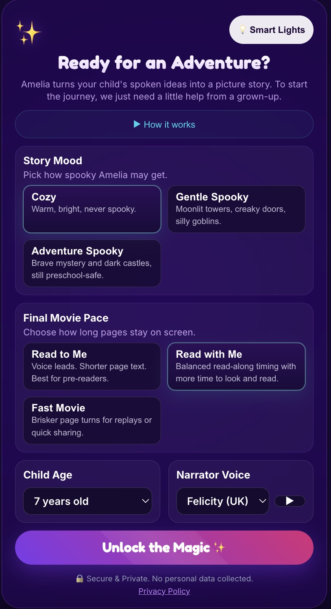
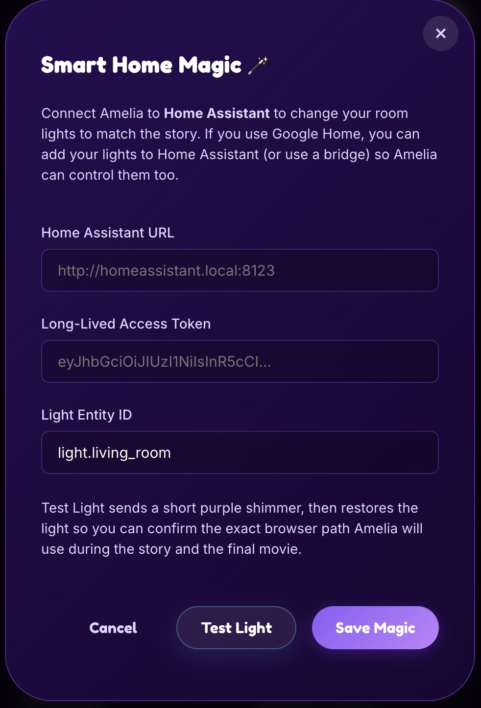
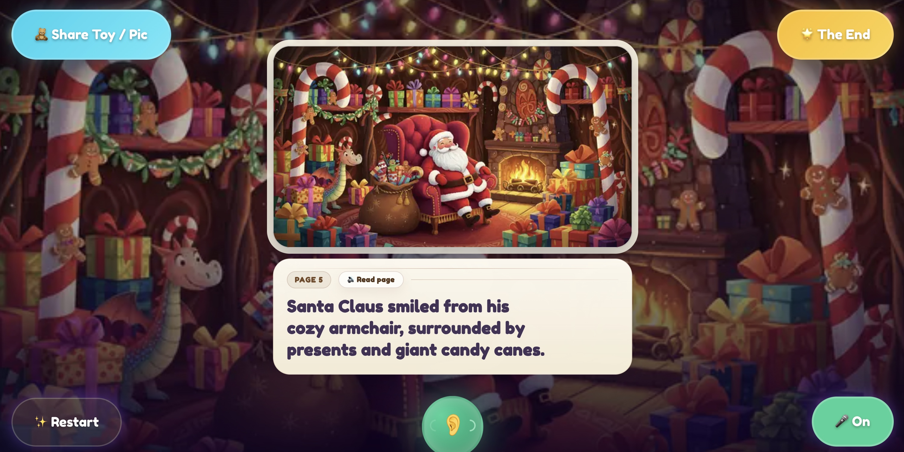
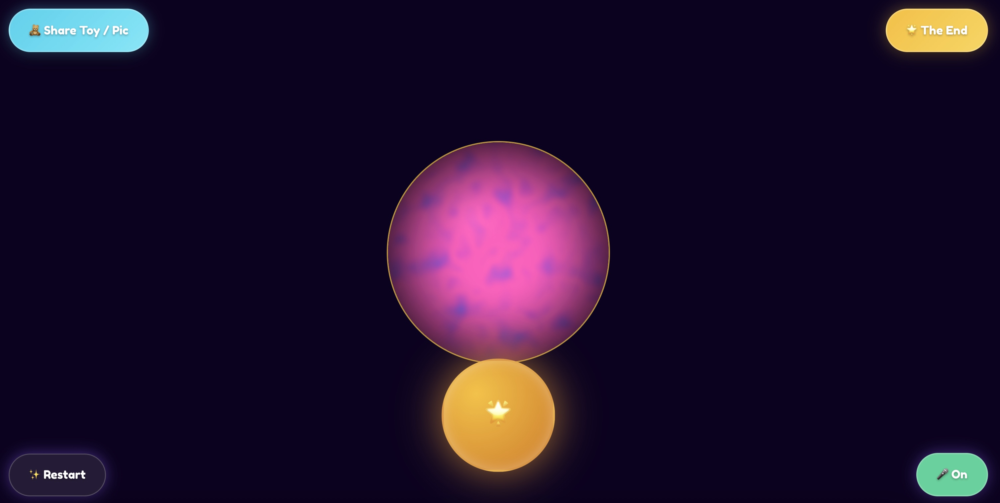
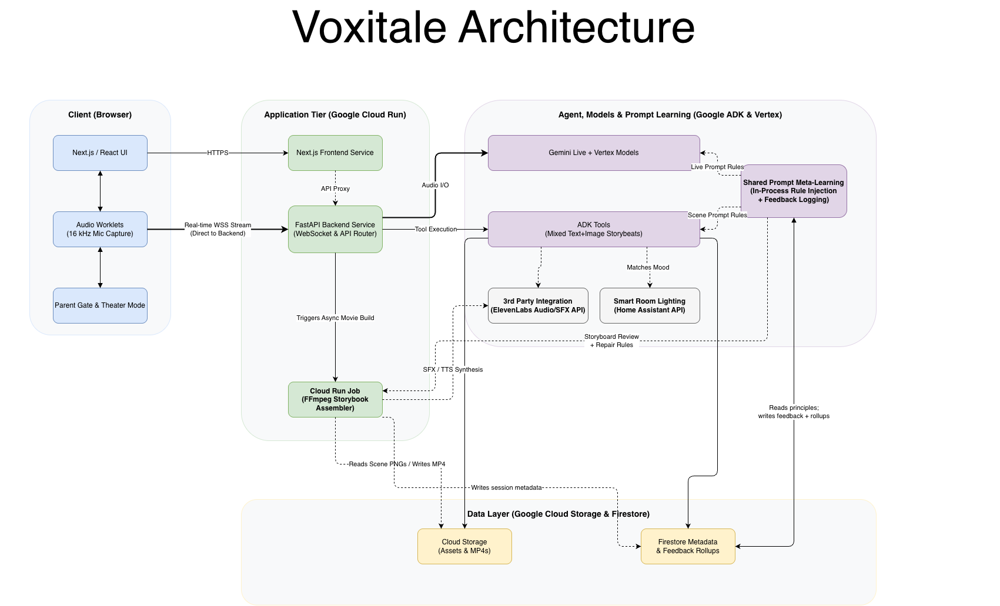

# Voxitale

Voxitale is a voice-first storytelling app for young children. A child talks to Amelia in the browser, the backend runs a Google ADK + Gemini live agent, scene illustrations are generated during the session, and the session ends as a storybook-style video with narration, music, and optional smart-home effects.

This repo contains the app code, Docker build definitions, and Google Cloud Terraform needed to reproduce the project.

## Demo

<p align="center">
  <a href="https://youtu.be/cAicGvqP9Mo?si=wrgnid53Y_yWy2gO">
    
  </a>
</p>

<p align="center">
  <strong><a href="https://youtu.be/cAicGvqP9Mo?si=wrgnid53Y_yWy2gO">Watch the Voxitale product walkthrough on YouTube</a></strong>
</p>

The demo highlights the guided story setup flow, optional Home Assistant lighting controls, live scene generation, and the final storybook-style playback experience.

## App Preview

<table>
  <tr>
    <td align="center" valign="top" width="50%">
      <br />
      <strong>Story setup</strong><br />
      Parents can choose the story mood, pacing, child age, narration voice, and connected smart-light behavior before the session begins.
    </td>
    <td align="center" valign="top" width="50%">
      <br />
      <strong>Smart-home controls</strong><br />
      Amelia can connect to Home Assistant so room lights can be tested in advance and synchronized with the story experience.
    </td>
  </tr>
  <tr>
    <td align="center" valign="top" width="50%">
      <br />
      <strong>Final storybook playback</strong><br />
      Each story ends as an illustrated, narrated playback with readable page text and simple sharing controls.
    </td>
    <td align="center" valign="top" width="50%">
      <br />
      <strong>Ambient finale</strong><br />
      Connected lights can add a simple synchronized room effect to the final playback for a more immersive finish.
    </td>
  </tr>
</table>

## Behind The Build

Voxitale was also documented as a multi-tool AI build journey, with both a written reflection and a creative companion piece:

- [What Building Voxitale for the Gemini Live Contest Taught Me About Working With Multiple AI Tools](https://dev.to/aaron_melton_0601b97a4b57/what-building-voxitale-for-the-gemini-live-contest-taught-me-about-working-with-multiple-ai-tools-3bjb) outlines the lessons learned while building the project across several AI systems and workflows.
- [I Owned the Fix](https://suno.com/s/Jr2kkQa3rm7WYs4u) is the accompanying Suno AI song inspired by that post and the experience of building Voxitale for the Gemini Live contest.

## Contest Fit

Voxitale is intended for the **Creative Storyteller** category of the Gemini Live Agent Challenge.

- **Gemini + ADK:** The backend uses Google ADK and Gemini Live for real-time voice interaction and story orchestration.
- **Interleaved multimodal output:** The experience combines spoken conversation, generated illustrations, readable story pages, narration, music, and a final storybook-style video in one cohesive flow.
- **Google Cloud hosted:** The backend, frontend, and FFmpeg worker are designed for Google Cloud deployment, with Cloud Run, Firestore, Cloud Storage, and Secret Manager in the stack.
- **Judge-friendly testing path:** The local runtime and mock lighting workflow let judges evaluate the core agent experience without requiring smart-home hardware.

## Submission Assets

- **Devpost submission:** [Voxitale on Devpost](https://devpost.com/software/wonderweave)
- **Demo video:** [Watch the Voxitale product walkthrough on YouTube](https://youtu.be/cAicGvqP9Mo?si=wrgnid53Y_yWy2gO)
- **Public code repository:** This repository is intended to be the public code repository linked from the Devpost submission.
- **Architecture diagram:** See [Architecture](#architecture)
- **Spin-up instructions:** See [Reproducing The Project](#reproducing-the-project)
- **Optional thought-leadership content:** See [Behind The Build](#behind-the-build)

## Google Cloud Proof

These repo files are the clearest code-level proof that Voxitale is built and hosted on Google Cloud:

- [`google_terraform/main.tf`](google_terraform/main.tf) provisions the Cloud Run backend, frontend, and FFmpeg job, and wires in Cloud Storage, Firestore, and runtime environment variables.
- [`google_terraform/secrets.tf`](google_terraform/secrets.tf) provisions Secret Manager secrets and the Firestore database used by the app.
- [`backend/main.py`](backend/main.py) loads Google Cloud configuration and creates the ADK runner with `GcsArtifactService`, binding the runtime to Cloud Storage and the Google project.
- [`backend/ws_router.py`](backend/ws_router.py) reads final story/movie state from Firestore during story completion and playback recovery.
- [`deploy.sh`](deploy.sh) automates container publishing and Google Cloud deployment updates.

For judges who want live-service verification, the Cloud Run validation commands are also listed in [Verification](#verification).

## Third-Party Integrations

The project uses the following non-Google integrations and companion content:

- **ElevenLabs:** Optional narration, music, and sound-effects enhancement. The core app can still run without an ElevenLabs key.
- **Home Assistant:** Optional smart-light integration for room lighting cues during the story and final playback.
- **Cloudflare Tunnel or Nabu Casa:** Optional ways to expose a Home Assistant instance over public `https://` for cloud-hosted testing.
- **Suno:** Used only for the companion song linked above. It is not part of the runtime path judges need to test.
- **Dev.to:** Used only for the public build write-up linked above. It is not part of the runtime path judges need to test.

## Prototype Notice

This project was developed quickly to explore real-time storytelling using Gemini Live and multiple AI tools.

Things that may still be rough:

- reconnect logic for Gemini Live sessions
- error handling around WebSocket streaming
- parts of the media generation pipeline
- documentation and repo structure

The goal of this repo is to demonstrate the architecture and ideas behind Voxitale rather than provide a production-ready system.

## What It Does

- Streams microphone audio from the browser to a live backend over `/ws/story`
- Runs a Gemini native-audio storyteller agent with Google ADK
- Generates live story scene images during the conversation
- Persists story state and artifacts in Firestore and Cloud Storage
- Assembles a final storybook video locally or through a Cloud Run Job
- Supports optional ElevenLabs narration and Home Assistant room-light cues

## Stack

| Layer | Implementation |
| --- | --- |
| Frontend | Next.js 15 + React 19 |
| Backend | FastAPI + Uvicorn |
| Live agent | Google ADK + Gemini native-audio |
| Scene generation | Gemini mixed `TEXT + IMAGE` flow |
| Final assembly | In-process assembly or FFmpeg Cloud Run Job |
| Storage | Cloud Storage |
| Persistence | Firestore |
| Secrets | Secret Manager |
| Infra | Terraform + Cloud Run + HTTPS Load Balancer |

## Architecture

The README uses the exported architecture image so it stays visually aligned with the authored source diagram. Production traffic still sits behind the HTTPS load balancer defined in Terraform.



## Repository Layout

- `agent/` - storyteller agent definition, prompts, and tools
- `backend/` - FastAPI app, WebSocket router, and FFmpeg worker
- `frontend/` - Next.js app and browser audio/WebSocket logic
- `google_terraform/` - Google Cloud infrastructure as code
- `shared/` - shared storybook and meta-learning helpers
- `deploy*.sh` - image build and deploy helpers

## Reproducing The Project

If you are evaluating this repo from a blank environment, start with the local app runtime. It is the most judge-friendly path because it does not require a custom domain, Cloud Run deployment, or real smart-home hardware. If you want to exercise the lighting flow without a Raspberry Pi or Home Assistant install, use the mock server documented in [ROOM_LIGHT_TESTING.md](ROOM_LIGHT_TESTING.md).

There are three practical ways to run this repo:

1. Local app runtime: run FastAPI and Next.js directly on your machine
2. Local Docker runtime: run the same backend/frontend images used for Cloud Run
3. Full Google Cloud deployment: provision infra with Terraform and deploy with Docker + Cloud Run

> Local development is still cloud-backed. The backend uses Google Cloud Storage and Firestore directly, so you need Google application credentials locally even if the frontend and backend are running on your laptop.

## Prerequisites

- Node.js 20+
- npm
- Python 3.11+
- `ffmpeg`
- Docker
- `gcloud`
- Terraform 1.5+
- A Google Cloud project with billing enabled
- A real domain or subdomain if you want to apply the current load-balancer Terraform unchanged

## 1. Configure Environment

Copy the example env file:

```bash
cp .env.example .env
```

If you are starting from a blank Google Cloud project, create the cloud-backed resources used by the local app before you start the backend. The local and local-Docker paths both assume these resources already exist.

```bash
export GOOGLE_CLOUD_PROJECT=your-project-id
export GOOGLE_CLOUD_LOCATION=us-central1

gcloud config set project "$GOOGLE_CLOUD_PROJECT"
gcloud services enable \
  aiplatform.googleapis.com \
  firestore.googleapis.com \
  storage.googleapis.com \
  texttospeech.googleapis.com

gcloud storage buckets create \
  "gs://${GOOGLE_CLOUD_PROJECT}-voxitale-assets" \
  --location="$GOOGLE_CLOUD_LOCATION"

gcloud storage buckets create \
  "gs://${GOOGLE_CLOUD_PROJECT}-voxitale-final-videos" \
  --location="$GOOGLE_CLOUD_LOCATION"

gcloud firestore databases create --location=nam5
```

If any of those resources already exist, reuse them and skip the matching create command. `nam5` matches the Terraform-backed Firestore setup in this repo, but another Firestore Native location also works if you keep your project configuration consistent.

If you already provisioned the project with Terraform instead, reuse the Terraform-created buckets and set `FIRESTORE_DATABASE=storyteller-lore` in `.env`.

At minimum, set these values in `.env`:

- `GOOGLE_API_KEY`
- `GOOGLE_CLOUD_PROJECT`
- `GCS_ASSETS_BUCKET`
- `GCS_FINAL_VIDEOS_BUCKET`
- `FIRESTORE_DATABASE`

Recommended local defaults:

- Use `FIRESTORE_DATABASE=(default)` for the manual local quickstart, or `storyteller-lore` if you already ran Terraform
- Set `GCS_ASSETS_BUCKET=${GOOGLE_CLOUD_PROJECT}-voxitale-assets` if you used the example bucket commands above
- Set `GCS_FINAL_VIDEOS_BUCKET=${GOOGLE_CLOUD_PROJECT}-voxitale-final-videos` if you used the example bucket commands above
- Keep `FRONTEND_ORIGIN=http://localhost:3000`
- Keep `GOOGLE_CLOUD_LOCATION=us-central1` unless you are changing regions everywhere
- Keep `LOCAL_STORYBOOK_MODE=1` for local-only runs so the backend assembles storybooks in-process instead of expecting the Cloud Run Job
- Leave `ELEVENLABS_API_KEY` blank if you do not have one; the app will fall back to Google Cloud TTS and skip ElevenLabs music/SFX
- If you want the most predictable no-ElevenLabs local run, set `ENABLE_STORYBOOK_MUSIC=0` and `ENABLE_STORYBOOK_SFX=0`

Notes:

- `GOOGLE_CLOUD_PROJECT_NUMBER` is included in `.env.example`, but the checked-in app does not require it for local reproduction
- The backend reads `.env` from the repo root; the frontend local dev flow works with the defaults in `frontend/next.config.js`

You also need Google application credentials for local and Docker runs. Use one of these:

```bash
gcloud auth application-default login
```

or

```bash
export GOOGLE_APPLICATION_CREDENTIALS=/absolute/path/to/service-account.json
```

## 2. Run Locally Without Docker

Start the backend in one terminal:

```bash
python3 -m venv .venv
source .venv/bin/activate
pip install -r backend/requirements.txt
uvicorn backend.main:app --host 0.0.0.0 --port 8000 --reload
```

Health check:

```bash
curl http://localhost:8000/health
```

Expected shape:

```json
{
  "status": "ok",
  "active_sessions": 0,
  "live_telemetry": {}
}
```

Start the frontend in a second terminal:

```bash
npm --prefix frontend install
npm --prefix frontend run dev
```

Then open `http://localhost:3000`.

Notes:

- In local development, [`frontend/next.config.js`](frontend/next.config.js) proxies `/api/*` and `/ws/*` to `http://localhost:8000`
- To disable the parent math gate locally, run the frontend with `NEXT_PUBLIC_REQUIRE_MATH=false`
- For a hardware-free lighting demo, follow the mock-server workflow in [ROOM_LIGHT_TESTING.md](ROOM_LIGHT_TESTING.md)

## 3. Run Locally With Docker

This repo ships Dockerfiles, not a committed `docker-compose.yml`. The supported Docker path is to run the backend and frontend containers separately.

If you authenticated with `gcloud auth application-default login`, your ADC file is usually:

```bash
export GCP_CREDS_JSON="$HOME/.config/gcloud/application_default_credentials.json"
```

If you are using a service-account JSON instead, point `GCP_CREDS_JSON` at that file path instead.

Build and run the backend:

```bash
docker build --platform linux/amd64 -t voxitale-backend -f backend/Dockerfile .
docker run --rm \
  --name voxitale-backend \
  --env-file .env \
  -e GOOGLE_APPLICATION_CREDENTIALS=/var/secrets/google/application_default_credentials.json \
  -v "$GCP_CREDS_JSON:/var/secrets/google/application_default_credentials.json:ro" \
  -p 8000:8080 \
  voxitale-backend
```

Build and run the frontend. These build args point the browser-facing URLs at the backend container published on `localhost:8000`, so local Docker does not depend on Next.js WebSocket proxy behavior:

```bash
docker build \
  --platform linux/amd64 \
  --build-arg NEXT_PUBLIC_REQUIRE_MATH=false \
  --build-arg NEXT_PUBLIC_SITE_URL=http://localhost:3000 \
  --build-arg NEXT_PUBLIC_BACKEND_URL=http://localhost:8000 \
  --build-arg NEXT_PUBLIC_UPLOAD_URL=http://localhost:8000/api/upload \
  --build-arg NEXT_PUBLIC_WS_URL=ws://localhost:8000/ws/story \
  -t voxitale-frontend \
  -f frontend/Dockerfile \
  frontend/

docker run --rm \
  --name voxitale-frontend \
  -p 3000:8080 \
  voxitale-frontend
```

Then open `http://localhost:3000`.

Notes:

- The backend container still needs Google Cloud credentials because it talks to GCS and Firestore
- For local Docker reproduction, keep `LOCAL_STORYBOOK_MODE=1` in `.env`; otherwise the backend expects the FFmpeg Cloud Run Job to exist

## 4. Deploy To Google Cloud With Terraform

The checked-in Terraform provisions:

- `storyteller-backend` Cloud Run service
- `storyteller-frontend` Cloud Run service
- `storyteller-ffmpeg-assembler` Cloud Run Job
- Cloud Storage buckets for session assets and final videos
- Firestore database `storyteller-lore`
- Secret Manager secrets for API keys
- Service accounts and IAM bindings
- A global HTTPS load balancer and managed certificate

Important constraint:

- The current Terraform requires `domain_name` and creates a managed SSL certificate and HTTPS load balancer
- The current Terraform also bakes that domain into backend allowed origins and bucket CORS, so browser-based use of direct `run.app` URLs is not the intended production path
- If you do not have a real domain/subdomain yet, change the Terraform before applying it or treat direct Cloud Run URLs as backend/service verification only

### First-Time Cloud Bootstrap

Set your project and region in the shell:

```bash
export GOOGLE_CLOUD_PROJECT=your-project-id
export GOOGLE_CLOUD_LOCATION=us-central1
```

Authenticate and create the Artifact Registry repository for the initial image push:

```bash
export ARTIFACT_REGISTRY_LOCATION="${ARTIFACT_REGISTRY_LOCATION:-$GOOGLE_CLOUD_LOCATION}"
export ARTIFACT_REGISTRY_REPO=voxitale

gcloud auth login
gcloud auth application-default login
gcloud config set project "$GOOGLE_CLOUD_PROJECT"
gcloud services enable artifactregistry.googleapis.com
gcloud artifacts repositories create "$ARTIFACT_REGISTRY_REPO" \
  --repository-format=docker \
  --location="$ARTIFACT_REGISTRY_LOCATION" \
  --description="Voxitale application images"
gcloud auth configure-docker "${ARTIFACT_REGISTRY_LOCATION}-docker.pkg.dev"
```

If the repository already exists, skip the `gcloud artifacts repositories create ...` line and continue.

Create your Terraform vars file from the committed example:

```bash
cp google_terraform/terraform.tfvars.example google_terraform/terraform.tfvars
```

Edit `google_terraform/terraform.tfvars` and replace:

- `project_id`
- `domain_name`
- the bootstrap image URIs if your region, repository name, or project name differ

Build and push the first set of images. These tags should match the bootstrap values in `terraform.tfvars`:

```bash
BACKEND_BOOTSTRAP_IMAGE="${ARTIFACT_REGISTRY_LOCATION}-docker.pkg.dev/$GOOGLE_CLOUD_PROJECT/$ARTIFACT_REGISTRY_REPO/storyteller-backend:bootstrap"
FRONTEND_BOOTSTRAP_IMAGE="${ARTIFACT_REGISTRY_LOCATION}-docker.pkg.dev/$GOOGLE_CLOUD_PROJECT/$ARTIFACT_REGISTRY_REPO/storyteller-frontend:bootstrap"
FFMPEG_BOOTSTRAP_IMAGE="${ARTIFACT_REGISTRY_LOCATION}-docker.pkg.dev/$GOOGLE_CLOUD_PROJECT/$ARTIFACT_REGISTRY_REPO/storyteller-ffmpeg:bootstrap"

docker build --platform linux/amd64 -t "$BACKEND_BOOTSTRAP_IMAGE" -f backend/Dockerfile .
docker push "$BACKEND_BOOTSTRAP_IMAGE"

docker build --platform linux/amd64 --build-arg NEXT_PUBLIC_REQUIRE_MATH=false -t "$FRONTEND_BOOTSTRAP_IMAGE" -f frontend/Dockerfile frontend/
docker push "$FRONTEND_BOOTSTRAP_IMAGE"

docker build --platform linux/amd64 -t "$FFMPEG_BOOTSTRAP_IMAGE" -f backend/ffmpeg_worker/Dockerfile .
docker push "$FFMPEG_BOOTSTRAP_IMAGE"
```

Apply Terraform:

```bash
cd google_terraform
terraform init
terraform apply -auto-approve
```

Seed the secret values after Terraform creates the Secret Manager resources:

```bash
echo -n "YOUR_GOOGLE_API_KEY" | gcloud secrets versions add storyteller-google-api-key --data-file=-
printf '%s' "${ELEVENLABS_API_KEY:-}" | gcloud secrets versions add storyteller-elevenlabs-api-key --data-file=-
```

If you do not have an ElevenLabs key, the empty secret version is fine. The deployed services will still start, and the app will fall back to Google Cloud TTS while skipping ElevenLabs-generated music/SFX.

Deploy fresh revisions once so Cloud Run picks up the real images and the now-seeded secrets:

```bash
cd ..
./deploy.sh all
```

Point your DNS `A` record at the load balancer IP:

```bash
cd google_terraform
terraform output load_balancer_ip
```

### Subsequent Deploys

After the initial bootstrap, use the deploy helpers from the repo root:

```bash
./deploy.sh all
./deploy.sh backend
./deploy.sh frontend
./deploy.sh ffmpeg
./deploy.sh terraform
```

`deploy.sh` builds new timestamped images, pushes them to Artifact Registry, updates the image tags inside `google_terraform/terraform.tfvars`, and runs `terraform apply` when requested. By default it uses `${ARTIFACT_REGISTRY_LOCATION:-us-central1}-docker.pkg.dev/$GOOGLE_CLOUD_PROJECT/${ARTIFACT_REGISTRY_REPO:-voxitale}`. If you need a different registry prefix, set `IMAGE_REGISTRY_PREFIX` before running the script.

## Verification

Local:

```bash
curl http://localhost:8000/health
```

Cloud:

```bash
gcloud run services describe storyteller-backend --region="$GOOGLE_CLOUD_LOCATION" --project="$GOOGLE_CLOUD_PROJECT" --format='value(status.url)'
gcloud run services describe storyteller-frontend --region="$GOOGLE_CLOUD_LOCATION" --project="$GOOGLE_CLOUD_PROJECT" --format='value(status.url)'
```

Backend health:

```bash
BACKEND_URL="$(gcloud run services describe storyteller-backend --region="$GOOGLE_CLOUD_LOCATION" --project="$GOOGLE_CLOUD_PROJECT" --format='value(status.url)')"
curl "$BACKEND_URL/health"
```

## Home Assistant Lighting

For the lighting path, see the [room light testing guide](ROOM_LIGHT_TESTING.md). It now documents the Raspberry Pi + Home Assistant + Matter Server setup, public HTTPS access through Cloudflare Tunnel or Nabu Casa, the required `configuration.yaml` proxy/CORS settings, and the mock-server workflow for fast local testing.
