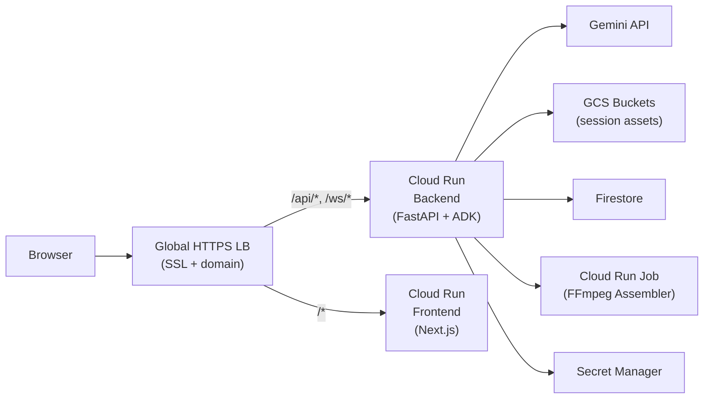

# Interactive Storyteller — Google Cloud Deployment Guide

> Self-service guide for deploying the Interactive Storyteller app to Google Cloud.  
> **Project:** `interactive-story-gemini` | **Region:** `us-central1`

---

## Architecture Overview

This diagram is the deployment and traffic-routing view. The top-level app architecture in the repo README mirrors the layered `StorySpark_Arch` diagram.



| Component | Cloud Run Service | Docker Context |
|---|---|---|
| Backend (FastAPI + ADK) | `storyteller-backend` | `backend/Dockerfile` (from project root) |
| Frontend (Next.js) | `storyteller-frontend` | `frontend/Dockerfile` (from `frontend/`) |
| FFmpeg Worker | `storyteller-ffmpeg-assembler` (Job) | `backend/ffmpeg_worker/Dockerfile` |

---

## Prerequisites

1. **gcloud CLI** installed and authenticated
2. **Terraform ≥ 1.5.0** installed
3. **Docker** installed and running
4. Access to GCP project `interactive-story-gemini`

```bash
# Authenticate and set project
gcloud auth login
gcloud config set project interactive-story-gemini
gcloud auth configure-docker  # allows docker push to gcr.io
```

---

## Step 1: Seed Secrets (First Time Only)

Your API keys live in **Secret Manager**, not in environment variables. Terraform creates the secret *shells* but you must add the actual secret values once:

```bash
# Google API Key (Gemini)
echo -n "YOUR_GOOGLE_API_KEY" | \
  gcloud secrets versions add storyteller-google-api-key --data-file=-

# ElevenLabs API Key
echo -n "YOUR_ELEVENLABS_API_KEY" | \
  gcloud secrets versions add storyteller-elevenlabs-api-key --data-file=-
```

> [!IMPORTANT]
> You only need to do this once. After seeding, Cloud Run will mount these automatically on every deploy.

---

## Step 2: Push & Deploy (One Command)

For code updates, you don't need to touch Terraform. Use the provided [deploy.sh](file:///Users/amelton/ADAI_Beta_Project/google-prog/deploy.sh) script:

```bash
# From project root (google-prog/)
chmod +x deploy.sh

# Deploy everything:
./deploy.sh all

# Or deploy specific components:
./deploy.sh backend
./deploy.sh frontend
```

This script will:
1. Build fresh Docker images with a timestamp tag.
2. Push them to Artifact Registry (GCR).
3. Update Cloud Run service/job immediately.

---

## Step 3: Terraform (Infra Only)

Only run Terraform if you change infrastructure (GCS buckets, IAM roles, secrets, or Load Balancer configs).

```bash
cd google_terraform/
terraform apply
```

Terraform will output:
- `backend_url` — Cloud Run backend URL
- `frontend_url` — Cloud Run frontend URL  
- `load_balancer_ip` — Static IP for your domain's DNS A record

---

## Step 5: DNS Setup (For Custom Domain)

Point your domain to the load balancer IP:

| Record Type | Host | Value |
|---|---|---|
| A | `storyteller.yourdomain.com` | `<load_balancer_ip from Step 4>` |

> [!NOTE]
> The managed SSL certificate will auto-provision once DNS propagates (usually 5-30 min). Until then, the HTTPS endpoint may show a certificate error.

If you don't have a custom domain yet, you can access the backend and frontend directly via the Cloud Run URLs from the Terraform output.

---

## Step 6: Verify Deployment

```bash
# Check Cloud Run services are serving
gcloud run services describe storyteller-backend --region=us-central1 --format="value(status.url)"
gcloud run services describe storyteller-frontend --region=us-central1 --format="value(status.url)"

# Health check
curl $(gcloud run services describe storyteller-backend --region=us-central1 --format="value(status.url)")/health
# Expected: {"status":"ok","active_sessions":0}
```

---

## Quick Redeploy (After Code Changes)

After making code changes, redeploy with:

```bash
# From project root (google-prog/)
TAG=$(date +%Y%m%d-%H%M%S)
PROJECT=interactive-story-gemini

# Rebuild only what changed:
docker build -t gcr.io/$PROJECT/storyteller-backend:$TAG -f backend/Dockerfile .
docker push gcr.io/$PROJECT/storyteller-backend:$TAG

# Update terraform.tfvars with new tag, then:
cd google_terraform/
terraform apply -auto-approve
```

---

## Troubleshooting

| Issue | Fix |
|---|---|
| `1008 Requested entity was not found` | Secret Manager secret has no version. Run Step 1 to seed secrets. |
| `ECONNREFUSED` on WebSocket | Backend isn't running. Check `gcloud run services logs storyteller-backend`. |
| SSL cert pending | DNS hasn't propagated yet. Wait 5-30 min after updating A record. |
| Image generation fails | Ensure `GOOGLE_API_KEY` secret is correctly set in Secret Manager. |
| `you need a private key to sign credentials` | GCS signed URLs require a service account key. The fallback to base64 data URLs should handle this automatically. |

---

## Infrastructure at a Glance

| Resource | Name | Purpose |
|---|---|---|
| Cloud Run Service | `storyteller-backend` | FastAPI + ADK, Gemini Live sessions |
| Cloud Run Service | `storyteller-frontend` | Next.js SSR |
| Cloud Run Job | `storyteller-ffmpeg-assembler` | Video assembly |
| GCS Bucket | `*-session-assets` | Scene images, audio (7-day TTL) |
| GCS Bucket | `*-final-videos` | Assembled movies (24-hour TTL) |
| Firestore | `storyteller-lore` | Cross-session character lore |
| Secret Manager | `storyteller-google-api-key` | Gemini API key |
| Secret Manager | `storyteller-elevenlabs-api-key` | ElevenLabs API key |
| Global LB + SSL | `storyteller-*` | HTTPS + domain routing |
| Service Accounts | `storyteller-backend-sa`, `storyteller-frontend-sa` | Least-privilege IAM |
